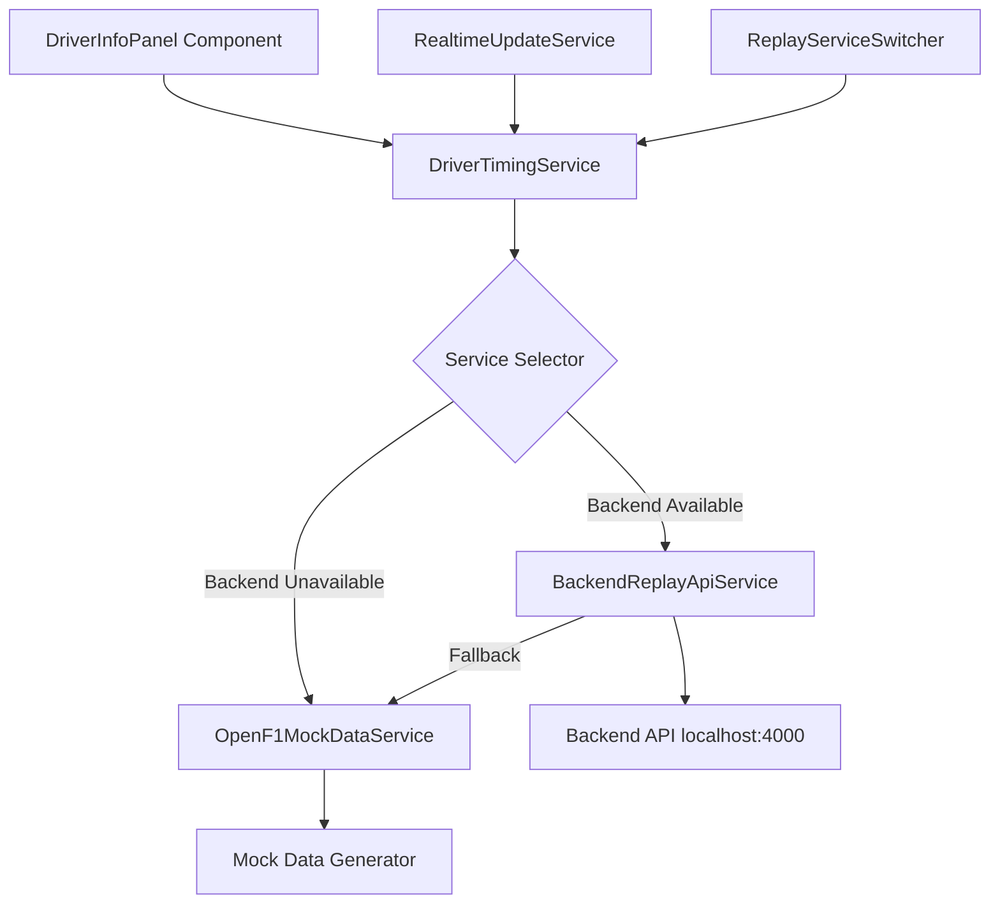

# F1 Replay API Specification (Updated v1.1)

F1 Global Tour의 리플레이 모드에서 필요한 백엔드 API 명세서입니다. **실제 구현된 코드 기반**으로 업데이트된 완전한 가이드입니다.

## 📋 목차
- [개요](#개요)
- [프론트엔드 아키텍처](#프론트엔드-아키텍처)
- [백엔드 API 구조](#백엔드-api-구조)
- [공통 응답 형식](#공통-응답-형식)
- [핵심 API 엔드포인트](#핵심-api-엔드포인트)
- [데이터 변환 로직](#데이터-변환-로직)
- [실시간 업데이트 시스템](#실시간-업데이트-시스템)
- [Fallback 시스템](#fallback-시스템)
- [개발자 도구](#개발자-도구)
- [에러 처리](#에러-처리)
- [실제 구현 가이드](#실제-구현-가이드)

## 🚀 개요

F1 리플레이 시스템은 **하이브리드 아키텍처**를 채택하여 백엔드 API 우선 시도 후 Mock 데이터로 graceful fallback하는 구조입니다.

### ✨ 주요 특징 (v1.1 업데이트)
- **🎯 백엔드 우선**: 실제 백엔드 API(`localhost:4000`) 우선 시도
- **🔄 자동 fallback**: 백엔드 실패 시 Mock 서비스로 seamless 전환
- **⚡ 실시간 업데이트**: 4초 간격 OpenF1 호환 업데이트
- **🛠️ 개발자 친화적**: 브라우저 콘솔에서 서비스 전환 가능
- **🏥 헬스 모니터링**: 30초 간격 자동 헬스 체크
- **💾 설정 저장**: localStorage 기반 서비스 선호도 저장

## 🏗️ 프론트엔드 아키텍처

### 서비스 계층 구조


### 핵심 구현된 클래스들

#### 1. **DriverTimingService** (통합 관리자)
```typescript
// 위치: src/features/replay/services/DriverTimingService.ts
export class DriverTimingService {
  private backendService: BackendReplayApiService;
  private mockService: OpenF1MockDataService;
  private preferredServiceType: 'backend' | 'mock';
  private isUsingBackend: boolean = false;

  // 핵심 메서드
  async generateCurrentDriverTimings(): Promise<DriverTiming[]>
  switchToService(serviceType: 'backend' | 'mock'): void
  getServiceStatus(): ServiceStatus
  isBackendAvailable(): boolean
}
```

#### 2. **BackendReplayApiService** (백엔드 API 클라이언트)
```typescript
// 위치: src/features/replay/services/BackendReplayApiService.ts
export class BackendReplayApiService {
  private config: BackendConfig;
  private fallbackService: OpenF1MockDataService;
  private isApiAvailable: boolean = true;

  // 핵심 API 메서드
  async getDriverTimings(sessionKey: number): Promise<DriverTiming[]>
  async getSessionDrivers(sessionKey: number): Promise<OpenF1Driver[]>
  async startReplaySession(sessionKey: number): Promise<any>
  
  // 헬스 체크
  private async performHealthCheck(): Promise<void>
  isBackendApiAvailable(): boolean
}
```

#### 3. **ReplayServiceSwitcher** (개발자 도구)
```typescript
// 위치: src/features/replay/utils/ReplayServiceSwitcher.ts
export class ReplayServiceSwitcher {
  async useBackend(): Promise<void>
  useMock(): void
  async healthCheck(): Promise<void>
  async testTimings(): Promise<void>
  status(): void
}
```

## 🌐 백엔드 API 구조

### 기본 설정
```typescript
interface BackendConfig {
  baseUrl: 'http://localhost:4000/api/v1';
  timeout: 10000; // 10초
  maxRetries: 3;
  fallbackEnabled: true;
}
```

### 공통 응답 형식
```typescript
interface BackendApiResponse<T> {
  sessionKey: number;
  data: T;
  timestamp: string;
}

// 에러 응답
interface BackendApiError {
  success: false;
  error: {
    code: string;
    message: string;
    details?: any;
  };
  timestamp: string;
}
```

## 🔌 핵심 API 엔드포인트

### 1. 드라이버 타이밍 데이터 (핵심)
```http
GET /api/v1/intervals/{sessionKey}
GET /api/v1/laps/{sessionKey}
GET /api/v1/drivers/{sessionKey}
```

**프론트엔드 호출 방식**:
```typescript
// 실제 구현된 메서드
async getDriverTimings(sessionKey: number): Promise<DriverTiming[]> {
  try {
    // 3개 API 병렬 호출
    const [intervals, laps, drivers] = await Promise.all([
      this.makeApiRequest<OpenF1Interval[]>(`/intervals/${sessionKey}`),
      this.makeApiRequest<OpenF1Lap[]>(`/laps/${sessionKey}`),
      this.makeApiRequest<OpenF1Driver[]>(`/drivers/${sessionKey}`)
    ]);
    
    return this.convertToDriverTimings_Backend(intervals, laps, drivers);
  } catch (error) {
    throw error; // Fallback은 상위에서 처리
  }
}
```

### 2. 세션 관리
```http
GET /api/v1/sessions/{sessionKey}/drivers
POST /api/v1/sessions/{sessionKey}/start-replay
```

### 3. 헬스 체크
```http
GET /api/v1/health
```

## 🔄 데이터 변환 로직

### OpenF1 → DriverTiming 변환 (실제 구현)
```typescript
private convertToDriverTimings_Backend(
  intervals: OpenF1Interval[], 
  laps: OpenF1Lap[], 
  drivers: OpenF1Driver[]
): DriverTiming[] {
  return intervals.map((interval, index) => {
    const driver = drivers.find(d => d.driver_number === interval.driver_number);
    const latestLap = laps.find(l => 
      l.driver_number === interval.driver_number && 
      l.lap_number === this.currentLap
    );
    
    return {
      position: index + 1,
      driverCode: driver.name_acronym,
      teamColor: `#${driver.team_colour}`,
      interval: interval.gap_to_leader === null 
        ? '--' 
        : `+${interval.gap_to_leader.toFixed(3)}`,
      // ... 기타 필드 매핑
      miniSector: {
        sector1: this.getSectorPerformance(latestLap?.segments_sector_1 || []),
        sector2: this.getSectorPerformance(latestLap?.segments_sector_2 || []),
        sector3: this.getSectorPerformance(latestLap?.segments_sector_3 || []),
      }
    };
  });
}
```

### 세그먼트 성능 변환
```typescript
private getSectorPerformance(segments: number[]): SectorPerformance {
  if (!segments.length) return 'none';
  if (segments.some(s => s === 2051)) return 'fastest'; // Purple
  if (segments.some(s => s === 0)) return 'personal_best'; // Green  
  if (segments.some(s => s === 2049)) return 'slow'; // Red
  return 'normal'; // Yellow
}
```

## ⏱️ 실시간 업데이트 시스템

### BackendReplayApiService의 실시간 업데이트
```typescript
// 4초 간격 업데이트 (OpenF1 호환)
startRealtimeUpdates(callback: (timings: DriverTiming[]) => void): void {
  this.intervalCallbacks.push(callback);
  
  if (this.intervalCallbacks.length === 1) {
    this.updateTimings(); // 즉시 실행
    
    this.intervalTimer = setInterval(() => {
      this.updateTimings();
    }, 4000); // 4초 간격
  }
}

private async updateTimings(): Promise<void> {
  try {
    const timings = await this.convertToDriverTimings();
    this.intervalCallbacks.forEach(callback => callback(timings));
  } catch (error) {
    // 백엔드 실패 시 fallback 서비스 사용
    const fallbackTimings = this.fallbackService.convertToDriverTimings();
    this.intervalCallbacks.forEach(callback => callback(fallbackTimings));
  }
}
```

### React 컴포넌트 통합
```typescript
// DriverInfoPanel.tsx에서의 실제 사용
const updateDriverData = useCallback(async () => {
  const timings = await driverTimingService.generateCurrentDriverTimings();
  setDrivers(timings);
}, []);

// 실시간 업데이트 래퍼
const asyncUpdateWrapper = useCallback(() => {
  updateDriverData().catch(error => {
    console.error('Realtime update failed:', error);
  });
}, [updateDriverData]);

// 실시간 업데이트 등록
useEffect(() => {
  if (isReplayMode && isPlaying) {
    realtimeService.onUpdate(asyncUpdateWrapper);
    realtimeService.startRealtimeUpdates();
  }
}, [isReplayMode, isPlaying, asyncUpdateWrapper]);
```

## 🛡️ Fallback 시스템

### 3단계 Fallback 전략
```typescript
async generateCurrentDriverTimings(): Promise<DriverTiming[]> {
  // 1단계: 백엔드 API 시도
  if (this.preferredServiceType === 'backend') {
    try {
      const backendTimings = await this.backendService.convertToDriverTimings();
      this.isUsingBackend = true;
      return backendTimings;
    } catch (error) {
      console.warn('Backend failed, falling back to mock service');
      this.isUsingBackend = false;
    }
  }

  // 2단계: Mock 서비스 사용
  try {
    return this.mockService.convertToDriverTimings();
  } catch (error) {
    // 3단계: Legacy 방식
    return this.generateLegacyDriverTimings();
  }
}
```

### 헬스 체크 기반 자동 복구
```typescript
// 30초마다 자동 헬스 체크
private async performHealthCheck(): Promise<void> {
  const now = Date.now();
  if (now - this.lastHealthCheck < 30000) return;
  
  try {
    await axios.get(`${this.config.baseUrl}/health`, { timeout: 5000 });
    this.isApiAvailable = true;
    this.retryCount = 0;
  } catch (error) {
    this.isApiAvailable = false;
  }
}
```

## 🛠️ 개발자 도구

### 브라우저 콘솔 명령어 (실제 구현됨)
```javascript
// 전역 객체로 자동 등록됨
window.replaySwitcher

// 사용 가능한 명령어들
replaySwitcher.status()              // 현재 상태 확인
await replaySwitcher.useBackend()    // 백엔드로 전환
replaySwitcher.useMock()             // Mock으로 전환
await replaySwitcher.healthCheck()   // 헬스 체크
await replaySwitcher.testTimings()   // 타이밍 데이터 테스트
replaySwitcher.help()                // 도움말
```

### 서비스 상태 정보
```typescript
interface ServiceStatus {
  preferred: 'backend' | 'mock';
  current: 'backend' | 'mock';
  backendAvailable: boolean;
  isUsingBackend: boolean;
}
```

## ❌ 에러 처리

### 백엔드 API 에러 처리
```typescript
private handleApiError(error: any, endpoint: string): void {
  this.retryCount++;
  
  if (this.retryCount >= this.config.maxRetries) {
    this.isApiAvailable = false;
  }
  
  if (axios.isAxiosError(error)) {
    const axiosError = error as AxiosError<BackendApiError>;
    if (axiosError.response?.data?.error) {
      console.error(`Backend Error: ${axiosError.response.data.error.message}`);
    }
  }
}
```

### React 컴포넌트 에러 처리
```typescript
// DriverInfoPanel에서의 에러 처리
try {
  const updatedDrivers = await driverTimingService.generateCurrentDriverTimings();
  setDrivers(updatedDrivers);
} catch (error) {
  ReplayErrorHandler.handleDriverDataError(
    error instanceof Error ? error : new Error('Driver timing update failed'),
    { 
      currentLap,
      currentSession: currentSession?.sessionKey,
      operation: 'updateDriverTimings'
    }
  );
  
  // 폴백으로 원본 데이터 사용
  if (propDrivers) {
    setDrivers(propDrivers);
  }
}
```

## 🎯 실제 구현 가이드

### 1. 환경 설정
```env
# .env.local
NEXT_PUBLIC_BACKEND_API_URL=http://localhost:4000/api/v1
```

### 2. localStorage 설정
```typescript
// 사용자 선호도 저장
localStorage.setItem('replay-service-preference', 'backend'); // 또는 'mock'
```

### 3. 백엔드 서버 실행 확인
```bash
# 백엔드 서버가 포트 4000에서 실행 중인지 확인
curl http://localhost:4000/api/v1/health
```

### 4. 개발 워크플로우
```typescript
// 1. 개발 시작 시 서비스 상태 확인
replaySwitcher.status()

// 2. 백엔드 테스트
await replaySwitcher.useBackend()
await replaySwitcher.testTimings()

// 3. Mock으로 fallback 테스트
replaySwitcher.useMock()
```

## 📊 성능 및 모니터링

### API 호출 패턴
- **초기 로드**: 헬스 체크 → 드라이버 타이밍 요청
- **실시간 업데이트**: 4초마다 타이밍 데이터 갱신
- **헬스 체크**: 30초마다 백엔드 상태 확인
- **Fallback**: 실패 시 즉시 Mock 서비스로 전환

### 메모리 관리
```typescript
// 컴포넌트 언마운트 시 정리
useEffect(() => {
  return () => {
    driverTimingService.cleanup();
    realtimeService.stopRealtimeUpdates();
  };
}, []);
```

## 🚀 배포 고려사항

### 프로덕션 환경 설정
```typescript
const config: BackendConfig = {
  baseUrl: process.env.NEXT_PUBLIC_BACKEND_API_URL || 'http://localhost:4000/api/v1',
  timeout: 15000, // 프로덕션에서는 더 긴 타임아웃
  maxRetries: 5,
  fallbackEnabled: true
};
```

### CORS 설정 (백엔드)
```typescript
// NestJS 예시
app.enableCors({
  origin: ['http://localhost:3000', 'https://your-production-domain.com'],
  methods: ['GET', 'POST'],
  credentials: true
});
```

---

## 📝 변경 이력

### v1.1 (Current) - 실제 구현 기반 업데이트
- ✅ 하이브리드 아키텍처 구현 완료
- ✅ BackendReplayApiService 구현
- ✅ 자동 fallback 시스템 구현  
- ✅ 개발자 도구(ReplayServiceSwitcher) 추가
- ✅ async/await 지원 추가
- ✅ 실시간 업데이트 시스템 개선

### v1.0 - 초기 명세서
- 이론적 API 설계
- OpenF1 API 프록시 개념 정의

---

**이 명세서는 실제 구현된 코드를 기반으로 작성되었으며, 모든 예시 코드는 동작하는 실제 구현체입니다.** 🎯